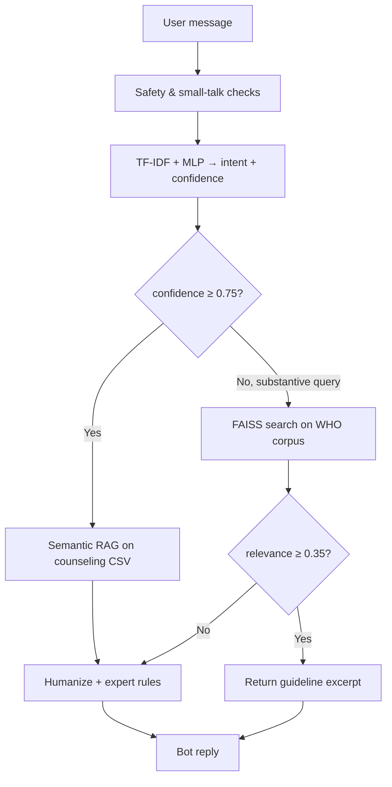

# MindSpace

A mental-health support chatbot built for a data-science lab project. MindSpace combines a **TF-IDF + MLP intent classifier**, **semantic retrieval** over counseling conversations, and a **FAISS-backed WHO/UNICEF knowledge path** when the model is uncertain. The UI is a Streamlit web app with accounts, saved chat history, optional voice input, and crisis-aware responses.

> **Important:** MindSpace is an educational prototype, not a licensed therapist or crisis service. If you or someone else is in danger, contact local emergency services or a crisis helpline immediately.

## Features

- **Dual-path responses** — high-confidence messages use empathetic replies from counseling data; low-confidence factual queries can surface WHO/UNICEF guideline excerpts.
- **Intent classification** — five intents: `depression_symptoms`, `anxiety_symptoms`, `stress_reaction`, `emotional_support`, `mental_health_faq`.
- **Humanized replies** — acknowledgments, trimmed core answers, and follow-ups tuned by emotion and conversation depth.
- **Safety layer** — crisis keywords trigger supportive escalation messaging before ML routing runs.
- **Accounts & persistence** — sign up / sign in with SQLite (`mindspace.db`); conversations and messages are stored per user.
- **Voice input** — optional microphone capture via `SpeechRecognition` (requires a working mic and `pyaudio`).
- **Dark UI** — custom Streamlit styling with sidebar chat history.

## How it works



| Threshold | Value | Role |
|-----------|-------|------|
| Classifier confidence | `0.75` | Route to WHO/FAISS path when below |
| FAISS relevance | `0.35` | Minimum cosine similarity to show an excerpt |

## Tech stack

- **UI:** [Streamlit](https://streamlit.io/)
- **Classifier:** scikit-learn (`TfidfVectorizer` + `MLPClassifier`)
- **Embeddings & retrieval:** [sentence-transformers](https://www.sbert.net/) (`all-MiniLM-L6-v2`), [FAISS](https://github.com/facebookresearch/faiss)
- **Data:** Hugging Face `datasets` (Amod counseling, dair-ai/emotion), optional WHO PDFs
- **Storage:** SQLite + PBKDF2 password hashing
- **Speech:** `SpeechRecognition`, `pyaudio`

## Project structure

```
Mindspace-DS-main/
├── app.py                      # Streamlit application
├── requirements.txt
├── data/
│   ├── prepare_data.py         # Build cleaned CSVs from Hugging Face
│   ├── build_who_corpus.py     # Chunk, embed, and index WHO/counseling corpus
│   ├── mental_health_cleaned.csv   # RAG counseling data (generated or committed)
│   ├── intent_train.csv            # MLP training data (generated or committed)
│   ├── faiss_who.index             # FAISS index (generated or committed)
│   └── faiss_who_chunks.pkl        # Chunk store (generated or committed)
├── model/
│   ├── train.py                # Train and save classifier
│   ├── predict.py              # Intent + confidence inference
│   ├── rag.py                  # High-confidence semantic retrieval
│   ├── faiss_rag.py            # Low-confidence WHO retrieval
│   ├── humanize.py             # Tone correction and response assembly
│   └── db.py                   # User/conversation persistence
├── docs/
│   ├── MindSpace_DS_Project_Notes.pdf
│   ├── build_docs.py           # Regenerate project PDF
│   └── diagrams.py             # Pipeline figures
└── .streamlit/config.toml
```

## Quick start

### Prerequisites

- Python 3.10+ recommended
- pip

### 1. Clone and install

```bash
git clone <your-repo-url>
cd Mindspace-DS-main
python -m venv .venv

# Windows (PowerShell)
.\.venv\Scripts\Activate.ps1

# macOS / Linux
source .venv/bin/activate

pip install -r requirements.txt
```

On Windows, if `pyaudio` fails to install, voice input will not work but the rest of the app will. You can skip it or install a prebuilt wheel for your Python version.

### 2. Run the app

If the repo includes pre-built artifacts (`model/*.pkl`, `data/faiss_who.*`), you can start immediately:

```bash
streamlit run app.py
```

Open the URL shown in the terminal (usually `http://localhost:8501`). Create an account on first visit.

### 3. Optional: Streamlit secrets

For deployed instances, put secrets in `.streamlit/secrets.toml` (this file is gitignored). Do not commit credentials.

## Rebuild pipeline (from scratch)

Use this when model or index files are missing, or you want to regenerate data.

```bash
# 1. Download & clean datasets → CSVs
python data/prepare_data.py

# 2. Train intent classifier → model/*.pkl (+ evaluation plots)
python model/train.py

# 3. Build WHO/counseling FAISS index → data/faiss_who.*
python data/build_who_corpus.py

# 4. Launch
streamlit run app.py
```

**WHO PDFs (optional):** Place PDFs in `data/who_corpus/` before step 3 for the most authentic corpus. Otherwise `build_who_corpus.py` attempts downloads from WHO IRIS and falls back to the Hugging Face `nbertagnolli/counsel-chat` dataset.

**First run note:** `sentence-transformers` downloads `all-MiniLM-L6-v2` on first use; allow network access and a few minutes for caching.

## Datasets

| Source | Used for | Output |
|--------|----------|--------|
| [Amod/mental_health_counseling_conversations](https://huggingface.co/datasets/Amod/mental_health_counseling_conversations) | High-confidence RAG replies | `data/mental_health_cleaned.csv` |
| [dair-ai/emotion](https://huggingface.co/datasets/dair-ai/emotion) | MLP intent training (~16k rows) | `data/intent_train.csv` |
| WHO IRIS PDFs / counsel-chat fallback | Low-confidence factual retrieval | `data/faiss_who.index`, `data/faiss_who_chunks.pkl` |

Intent labels on the counseling set are assigned with keyword rules in `data/prepare_data.py`. The emotion dataset labels are mapped to the same five intents used at runtime.

## Documentation

A full write-up with pipeline diagrams lives in:

`docs/MindSpace_DS_Project_Notes.pdf`

To regenerate figures and the PDF:

```bash
python docs/diagrams.py
python docs/build_docs.py
```

## Configuration

| File | Purpose |
|------|---------|
| `.streamlit/config.toml` | Theme and server defaults |
| `app.py` → `CONFIDENCE_THRESHOLD` | Classifier routing cutoff (default `0.75`) |
| `model/faiss_rag.py` → `_MIN_RELEVANCE` | Minimum FAISS match score (default `0.35`) |

Runtime data:

- `mindspace.db` — created automatically; stores users and chats (gitignored).

## Git & ignored files

See `.gitignore`. Committed artifacts (when present) let clones run without rebuilding. Local databases, caches, virtualenvs, and secrets are never committed.

## Limitations

- Responses are retrieved and templated, not from a frontier LLM; quality depends on dataset coverage and classifier confidence.
- Intent labels on counseling data are heuristic, not clinician-verified.
- Crisis detection is keyword-based and cannot replace professional crisis intervention.
- Not suitable for production clinical use without review, compliance work, and human oversight.

## License

Academic / coursework project unless otherwise specified by the course or repository owner.
